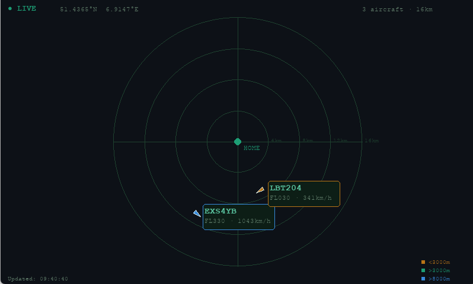

# raspberryRadar



A real-time flight radar display for the Raspberry Pi. Shows all aircraft flying over your location using live data from the OpenSky Network, rendered as a dark radar screen with Pygame. Tap an aircraft to see its route, airline, and aircraft type, with a direct link to Flightradar24.

---

## Features

- Live aircraft positions updated at a configurable interval (OpenSky Network)
- Radar-style display with range rings and heading indicators
- Color-coded altitude layers (blue / green / amber)
- Click or tap any aircraft label to open a detail panel
- Detail panel shows ICAO, callsign, country, altitude, speed, heading, and distance from home
- Optional route data (origin, destination, airline, aircraft type) via SkyLink or AviationStack
- "Open in Flightradar24" button in the detail panel
- Daily cache for route lookups — each callsign queried at most once per day
- Autostart on boot via systemd

---

## Files

| File | Description |
|---|---|
| `config.py` | All user settings: coordinates, radius, resolution, provider, CSV paths |
| `secrets.py` | Loads API keys and OpenSky credentials from `secrets.json` |
| `secrets.json` | Your API keys and OpenSky OAuth2 credentials (gitignored, you create this) |
| `secrets.template.json` | Template showing the expected structure of `secrets.json` |
| `api.py` | OpenSky Network API query (OAuth2) and helper functions |
| `main.py` | Pygame radar display — main entry point |
| `flightinfo.py` | Route/aircraft lookup (SkyLink or AviationStack) with daily cache |
| `install.sh` | Installs all dependencies on Raspberry Pi OS |
| `autostart.sh` | Registers a systemd service for autostart on boot |
| `iata-icao.csv` | ICAO airport code → airport name, country code |
| `countries.csv` | Country code → country name |
| `icao_airlines.csv` | ICAO airline code → airline name |

---

## Quick Start

### 1. Copy files to the Pi

Via network:
```bash
scp -r raspberryRadar/ pi@<IP-ADDRESS>:~/
```
Or copy via USB stick.

### 2. Run the installer

```bash
cd ~/raspberryRadar
bash install.sh
```

### 3. Set up your secrets

```bash
cp secrets.template.json secrets.json
nano secrets.json
```

Fill in your OpenSky OAuth2 credentials and SkyLink/AviationStack API key (see [APIs](#apis) below for how to obtain these). `secrets.json` is gitignored and never committed.

### 4. Set your coordinates

```bash
nano config.py
```

Set `HOME_LAT` and `HOME_LON` to your GPS coordinates.
You can find them by right-clicking your house in Google Maps — the first line shown is your coordinates.

### 5. Launch

```bash
python3 main.py
```

Press `ESC` or `Q` to quit. Press either key once to close an open detail panel, twice to exit the app.

### 6. Enable autostart (optional)

```bash
bash autostart.sh
```

The radar will now launch automatically on every boot.

Manage the service:
```bash
sudo systemctl start raspberryradar
sudo systemctl stop raspberryradar
sudo systemctl status raspberryradar
```

---

## Configuration (`config.py`)

| Parameter | Default | Description |
|---|---|---|
| `HOME_LAT` | `51.4365` | Home latitude (decimal degrees) |
| `HOME_LON` | `6.9147` | Home longitude (decimal degrees) |
| `HOME_NAME` | `"HOME"` | Label shown at radar center |
| `RADIUS` | `0.15` | Search radius in degrees (~17 km) |
| `UPDATE_INTERVAL` | `15` | Seconds between OpenSky API refreshes — see rate limits below |
| `SCREEN_WIDTH` | `800` | Display width in pixels |
| `SCREEN_HEIGHT` | `480` | Display height in pixels |
| `FULLSCREEN` | `False` | `True` for fullscreen, `False` for windowed |
| `FLIGHTINFO_PROVIDER` | `"skylink"` | Route data source: `"skylink"` or `"aviationstack"` |
| `SECRETS_FILE` | `"secrets.json"` | Path to the JSON file holding all API keys and OpenSky credentials |
| `AIRPORTS_CSV` | `"iata-icao.csv"` | Airport name/country lookup table |
| `COUNTRIES_CSV` | `"countries.csv"` | Country name lookup table |
| `AIRLINES_CSV` | `"icao_airlines.csv"` | Airline name lookup table |

**Radius guide:**

| RADIUS value | Approximate coverage |
|---|---|
| `0.15` | ~17 km — your immediate area |
| `0.5` | ~55 km — regional |
| `0.8` | ~89 km — wide area |
| `1.0` | ~111 km — maximum recommended |

---

## Color Legend

| Color | Altitude |
|---|---|
| Blue | Above 8,000 m — cruise altitude |
| Green | 3,000 – 8,000 m — mid altitude |
| Amber | Below 3,000 m — low altitude / approach |

---

## APIs

All API keys and OpenSky OAuth2 credentials live in `secrets.json` (gitignored). Copy `secrets.template.json` to `secrets.json` and fill in your values — see the structure below.

```json
{
  "opensky": {"clientId": "...", "clientSecret": "..."},
  "skylink_key": "...",
  "aviationstack_key": "..."
}
```

### OpenSky Network (required)
Provides live aircraft positions, altitude, speed, and heading. Uses OAuth2 client credentials authentication.

**Setup:**
1. Create a free account at https://opensky-network.org/
2. Generate API credentials (clientId + clientSecret) from your account page
3. Add them to `secrets.json` under `"opensky"`

Leave `clientId`/`clientSecret` empty in `secrets.json` to use anonymous access instead (lower rate limit, no setup required).

**Rate limits** ([source](https://openskynetwork.github.io/opensky-api/rest.html#limitations)):

| Access | Daily limit | Minimum `UPDATE_INTERVAL` |
|---|---|---|
| Anonymous (no account) | 400 calls/day | ~216 seconds (~3.6 min) |
| Authenticated (free account) | 4,000 calls/day | ~21.6 seconds |

Choose `UPDATE_INTERVAL` based on your access level — going below these values risks hitting `429 Too Many Requests` and temporary blocks. The default `UPDATE_INTERVAL = 15` requires an authenticated account.

Example query for your location:
```
https://opensky-network.org/api/states/all?lamin=51.28&lamax=51.59&lomin=6.76&lomax=7.06
```

### SkyLink (default route provider)
Provides route (origin/destination), airline, and aircraft type via two endpoints:
- `/routes/callsign/{callsign}` — route lookup
- `/aircraft/icao24/{icao24}` — aircraft type lookup

- Accessed via RapidAPI: https://rapidapi.com/
- **Free tier: 1,000 requests/day**
- Add your RapidAPI key to `secrets.json` as `"skylink_key"`
- Each tap on an aircraft uses up to 2 requests (route + aircraft type), cached for the day — so roughly 500 unique flights/day before hitting the limit
- Does not provide scheduled/actual times
- This is the provider actually used and tested in this project

### AviationStack (alternative route provider)
Provides full flight details: origin, destination, scheduled and actual times, aircraft type.

- Sign up at https://aviationstack.com/
- Free plan limits: *TBD — check current plan details at signup*
- Set `FLIGHTINFO_PROVIDER = "aviationstack"` in `config.py` and add your key to `secrets.json` as `"aviationstack_key"`
- Only returns data for currently active flights

> **Note:** AviationStack support is implemented but **not tested end-to-end** — during development the AviationStack API was unreachable/down, which is why SkyLink was added as an alternative and became the default, tested provider. If you use AviationStack and run into issues, check `flightinfo.log` for the raw API responses.

### Switching providers
Set `FLIGHTINFO_PROVIDER` in `config.py` to `"skylink"` or `"aviationstack"`. Only the selected provider's key needs to be set in `secrets.json`. Leave both keys empty to run in position-only mode (no route/aircraft data, no Flightradar24 button limitations).

All API calls and responses are logged to `flightinfo.log` for debugging. Route/aircraft lookups are cached in `flightinfo_cache.json` — each callsign is queried at most once per day. Delete this file to force fresh lookups.

---

## Static Lookup Tables

These CSV files translate codes returned by the APIs into readable names. Paths are configurable in `config.py`.

| File | Purpose | Columns used |
|---|---|---|
| `iata-icao.csv` | ICAO airport code → airport name + country code | `icao`, `airport`, `country_code` |
| `countries.csv` | Country code → country name | `Code`, `Countryname` |
| `icao_airlines.csv` | ICAO airline code → airline name | `ICAO`, `Airline`, `Comments` |

If a file is missing, the corresponding raw code is shown instead of a name (the app keeps running).

---

## Recommended Display Resolutions

| Display | `SCREEN_WIDTH` | `SCREEN_HEIGHT` |
|---|---|---|
| 7" Waveshare HDMI | 800 | 480 |
| 5" Waveshare HDMI | 800 | 480 |
| 10" standard HDMI | 1280 | 800 |
| PC testing (windowed) | 800 | 600 |

---

## Troubleshooting

**No aircraft visible**
- Check your internet connection on the Pi
- Increase `RADIUS` in `config.py` — a small radius may show no traffic
- OpenSky may occasionally be slow to respond; the display shows `● LOADING...` while waiting

**`429 Too Many Requests` from OpenSky**
- `UPDATE_INTERVAL` is too low for your access level — see rate limits above
- With anonymous access, use `UPDATE_INTERVAL >= 220`
- With an authenticated account, use `UPDATE_INTERVAL >= 22`

**Route/aircraft data not loading**
- Check `flightinfo.log` for error details
- Delete `flightinfo_cache.json` to force a fresh lookup
- Verify the correct provider is set in `FLIGHTINFO_PROVIDER` and its key is filled in

**Display too small / text hard to read**
- Use a 7" display instead of 5" for the same 800×480 resolution
- Increase font sizes in `main.py` if needed

**"Open in Flightradar24" opens a slow browser**
- Chromium can take 10-15 seconds to start on a Raspberry Pi 2
- The radar window stays in the background until the browser is closed
